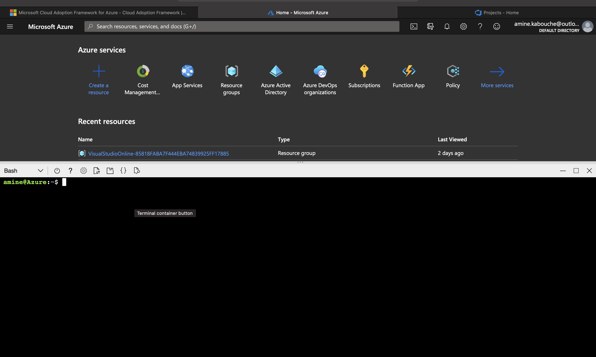

[](https://github.com/Amine24h/building-a-ci-cd-pipeline/actions/workflows/pythonapp.yml)

[](https://dev.azure.com/aminekabouche/building-a-ci-cd-pipeline/_build/latest?definitionId=6&branchName=main)

# Overview
This project Setup a Continuous Integration/Continuous delivery pipeline for a Python-based machine learning application using the Flask web framework. At the end a fully tested Flask web application will be deployed in Azure App Service

## Project Plan
* A [Trello board](https://trello.com/b/HQVQEKxr/buildingcicdpipeline) for the project
* A [Spreadsheet](project-plan.xlsx) that includes the project plan

## Instructions

### Architectural Diagram :


## Launch Azure Cloud Shell



## Generate SSH key and upload the public key to github

```
ssh-keygen -t rsa
```


## Clone the repository using Azure Cloud Shell

```
git clone git@github.com:Amine24h/building-a-ci-cd-pipeline.git
```


## Create a new python virtual environnement

```
cd building-a-ci-cd-pipeline
python -m venv building-a-ci-cd-pipeline-venv
. building-a-ci-cd-pipeline-venv/bin/activate
```

## Install dependencies and build the app

```
make all
```


## Create Azure App Service

```
az webapp up --sku B1 -n building-a-ci-cd-pipeline-service
```


## Setup Azure DevOps

- Go to https://dev.azure.com and sign in.
- Create a new private project.
- Under Project Settings create a new service connection and select Azure Resource Manager.
- Create a Python-specific pipeline to deploy to App Service, and linked it to your GitHub repo.


## Get app logs

```
az webapp log tail --name building-a-ci-cd-pipeline-service --resource-group amine.kabouche_rg_Linux_centralus
```


## Test the app is up and running

```bash
udacity@Azure:~$ ./make_predict_azure_app.sh
Port: 443
{"prediction":[20.35373177134412]}
```

> Don't forget to set the app name inside **make_predict_azure_app.sh** file


## Load testing

- Install locust (performance testing tool)
```bash
pip install locust
```
- Start locust (performance testing tool)
```bash
locust
```
- Open a browser and go to http://localhost:8089.
- Enter the total number of users to simulate and spawn rate.
- Set the host with the link to azure webapp https://building-ci-cd-pipelines.azurewebsites.net and click Start Swarming.


## Enhancements

One area that we could improve is to have multiple environments (Dev, Staging and Production) and have a pipeline for each environment.

## Demo 

<TODO: Add link Screencast on YouTube>


